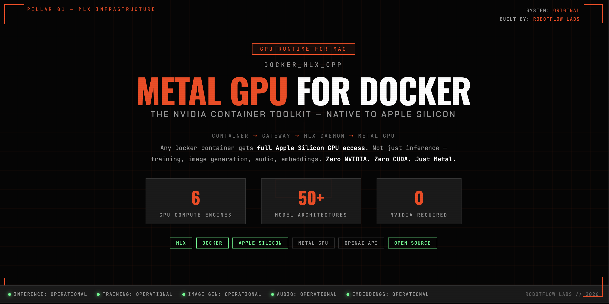

# docker_mlx_cpp

<p align="center">
  
</p>

<h3 align="center">The NVIDIA Container Toolkit — for Mac</h3>

<p align="center">
  <strong>Give any Docker container full Apple Silicon Metal GPU access.</strong><br>
  100+ GPU operations • LLM inference • Training • Image gen • Audio • Embeddings<br>
  Zero CUDA. Zero NVIDIA. Just Metal.
</p>

<p align="center">
  <a href="#quick-start"></a>
  <a href="https://github.com/RobotFlow-Labs/docker_mlx_cpp/releases"></a>
  <a href="LICENSE"></a>
  <a href="https://github.com/RobotFlow-Labs/docker_mlx_cpp"></a>
</p>

## One-Line Install

```bash
curl -fsSL https://raw.githubusercontent.com/RobotFlow-Labs/docker_mlx_cpp/main/install.sh | bash
```

This installs everything: MLX, all GPU engines, the daemon, the Docker gateway. One command.

```
┌──────────────────────────────────────────────────────┐
│  ANY Docker Container                                 │
│  (Python, Node, Rust, Go, curl — anything)           │
│  Uses: OpenAI SDK, docker_mlx SDK, or raw HTTP       │
└────────────────────────┬─────────────────────────────┘
                         │ HTTP :8080
┌────────────────────────▼─────────────────────────────┐
│  mlx-gateway (container)                              │
│  ├── /v1/*           → inference (LLM, VLM)          │
│  ├── /v1/embeddings  → embedding generation          │
│  ├── /v1/audio/*     → Whisper STT + TTS             │
│  ├── /v1/images/*    → Stable Diffusion / FLUX       │
│  ├── /train/*        → LoRA / QLoRA fine-tuning      │
│  └── /models/*       → model management              │
└────────────────────────┬─────────────────────────────┘
                         │ host.docker.internal:12435
┌────────────────────────▼─────────────────────────────┐
│  MLX Daemon (host-side, native macOS)                 │
│  ├── Inference:   mlx-lm (50+ architectures)         │
│  ├── Vision:      mlx-vlm (images + video)           │
│  ├── Training:    LoRA, QLoRA, DPO                   │
│  ├── Image Gen:   Stable Diffusion, SDXL, FLUX       │
│  ├── Audio:       Whisper STT + TTS                  │
│  ├── Embeddings:  Jina v5, BGE, mlx-embeddings       │
│  └── Models:      pull, cache, convert, presets      │
└────────────────────────┬─────────────────────────────┘
                         │ Metal API
┌────────────────────────▼─────────────────────────────┐
│  Apple Silicon M1/M2/M3/M4/M5 — Metal GPU           │
│  Unified Memory • 20-30% faster than llama.cpp       │
└──────────────────────────────────────────────────────┘
```

## Why

On Linux, `nvidia-docker` gives containers `--gpus all` and full CUDA access. On Mac, **nothing equivalent exists** — Metal GPU can't be passed into Docker's Linux VM.

**docker_mlx_cpp** solves this by running a host-side MLX daemon that exposes the full Apple Silicon GPU stack to any container through standard APIs. Your containers speak OpenAI API. Your Mac does the Metal compute.

| Capability | NVIDIA Container Toolkit | docker_mlx_cpp |
|-----------|-------------------------|----------------|
| GPU from containers | `--gpus all` (CUDA) | `http://mlx-gateway:8080` (Metal) |
| LLM inference | vLLM, TGI, Triton | mlx-lm (50+ architectures) |
| Training | PyTorch + NCCL | LoRA, QLoRA, DPO via MLX |
| Image generation | Stable Diffusion (CUDA) | SD, SDXL, FLUX (Metal) |
| Audio | Whisper (CUDA) | Whisper + TTS (Metal) |
| Embeddings | sentence-transformers | mlx-embeddings, Jina v5 |
| Model format | Framework-specific | MLX Safetensors (HuggingFace) |
| Setup | nvidia-container-toolkit | `pip install docker-mlx-cpp` |

## Quick Start

```bash
# 1. Install
pip install -e ".[all]"

# 2. Start the MLX Daemon (host-side GPU service)
mlx-cpp serve

# 3. Start the gateway (in Docker)
docker compose up -d mlx-gateway

# 4. Pull a model
mlx-cpp models pull mlx-community/SmolLM2-360M-Instruct-4bit

# 5. Use from ANY container
docker run --rm --network mlx-network curlimages/curl:8.5.0 \
  curl -s http://mlx-gateway:8080/v1/chat/completions \
  -H "Content-Type: application/json" \
  -d '{"model":"mlx-community/SmolLM2-360M-Instruct-4bit","messages":[{"role":"user","content":"Hello from Docker!"}]}'
```

## CLI

```bash
mlx-cpp serve                    # Start GPU daemon
mlx-cpp run <model> "prompt"     # Quick inference
mlx-cpp models list              # Show cached models
mlx-cpp models pull <model>      # Pull from HuggingFace
mlx-cpp health                   # Check daemon + GPU status
mlx-cpp gpu                      # Show GPU info
mlx-cpp benchmark <model>        # Performance benchmark
mlx-cpp train lora --model ...   # LoRA fine-tuning
```

## Model Presets

Use human-readable presets instead of full model IDs:

```bash
mlx-cpp run chat-small "hello"       # SmolLM2-360M (8GB Mac)
mlx-cpp run chat-default "hello"     # Llama-3.2-3B (8GB+)
mlx-cpp run code "write a function"  # Qwen2.5-Coder-7B (16GB+)
mlx-cpp run vision "describe image"  # Qwen2-VL-7B (16GB+)
```

See all presets: [`models/presets.yaml`](models/presets.yaml)

## Use in Your docker-compose.yml

```yaml
services:
  your-app:
    image: your-app
    environment:
      - OPENAI_BASE_URL=http://mlx-gateway:8080/v1
      - OPENAI_API_KEY=not-needed
      - OPENAI_MODEL=mlx-community/Llama-3.2-3B-Instruct-4bit
    networks:
      - mlx-network

networks:
  mlx-network:
    external: true
```

Zero code changes needed — any app using the OpenAI SDK works out of the box.

## API Endpoints

### Inference (OpenAI-compatible)
| Endpoint | Description |
|----------|-------------|
| `POST /v1/chat/completions` | Chat inference (LLM/VLM) |
| `POST /v1/completions` | Text completions |
| `POST /v1/embeddings` | Text embeddings |
| `GET /v1/models` | List available models |

### Audio (OpenAI-compatible)
| Endpoint | Description |
|----------|-------------|
| `POST /v1/audio/transcriptions` | Whisper speech-to-text |
| `POST /v1/audio/speech` | Text-to-speech |

### Image Generation (OpenAI-compatible)
| Endpoint | Description |
|----------|-------------|
| `POST /v1/images/generations` | Stable Diffusion / FLUX |

### Training (custom)
| Endpoint | Description |
|----------|-------------|
| `POST /train/lora` | Start LoRA/QLoRA fine-tuning |
| `GET /train/jobs` | List training jobs |
| `GET /train/jobs/{id}` | Get job status |

### Management
| Endpoint | Description |
|----------|-------------|
| `POST /models/pull` | Pull model from HuggingFace |
| `POST /models/delete` | Remove cached model |
| `GET /health` | Gateway + daemon + GPU status |
| `GET /metrics` | Prometheus metrics |

## Project Structure

```
docker_mlx_cpp/
├── daemon/                      # Host-side MLX daemon
│   ├── mlx_daemon.py           # FastAPI main app (port 12435)
│   ├── model_manager.py        # Model pull/cache/convert
│   ├── engines/
│   │   ├── inference.py        # LLM/VLM inference (mlx-lm)
│   │   ├── training.py         # LoRA/QLoRA fine-tuning
│   │   ├── embeddings.py       # Text embeddings
│   │   ├── audio.py            # Whisper STT + TTS
│   │   └── image_gen.py        # Stable Diffusion / FLUX
│   └── com.robotflow.mlx-daemon.plist  # macOS auto-start
├── gateway/                     # Docker container gateway
│   ├── Dockerfile
│   ├── server.py               # Unified reverse proxy
│   └── requirements.txt
├── cli/
│   └── mlx_cpp.py              # CLI tool (mlx-cpp)
├── models/
│   └── presets.yaml             # Curated model presets
├── examples/
│   ├── python-client/           # Python OpenAI SDK example
│   └── curl-test.sh            # Quick smoke test
├── scripts/
│   ├── setup.sh                # First-time setup
│   └── benchmark.sh            # Performance benchmark
├── sdk/                         # Client SDKs (coming)
│   └── python/docker_mlx/
├── tests/
├── docker-compose.yml
├── pyproject.toml
└── README.md
```

## How It Works

Metal GPU **cannot** be passed into Docker containers on macOS (confirmed by Docker, Apple, and Red Hat). The VM boundary blocks it.

docker_mlx_cpp uses the same pattern as NVIDIA's container toolkit, adapted for Mac:

1. **MLX Daemon** runs natively on macOS with direct Metal GPU access
2. **Gateway container** routes HTTP requests from Docker network to the daemon
3. **Any container** calls the gateway using standard OpenAI API — no special runtime needed

MLX is 20-30% faster than llama.cpp on Apple Silicon and supports the full ML stack: inference, training, image generation, audio, embeddings, and custom Metal kernels.

## Requirements

- **macOS** on Apple Silicon (M1/M2/M3/M4/M5)
- **Docker Desktop** 4.62+
- **Python** 3.11+
- **MLX** (installed automatically with `pip install docker-mlx-cpp[all]`)

## License

MIT

---

**Built by [RobotFlow Labs](https://github.com/RobotFlow-Labs) — Making Mac GPUs work like NVIDIA for Docker.**
